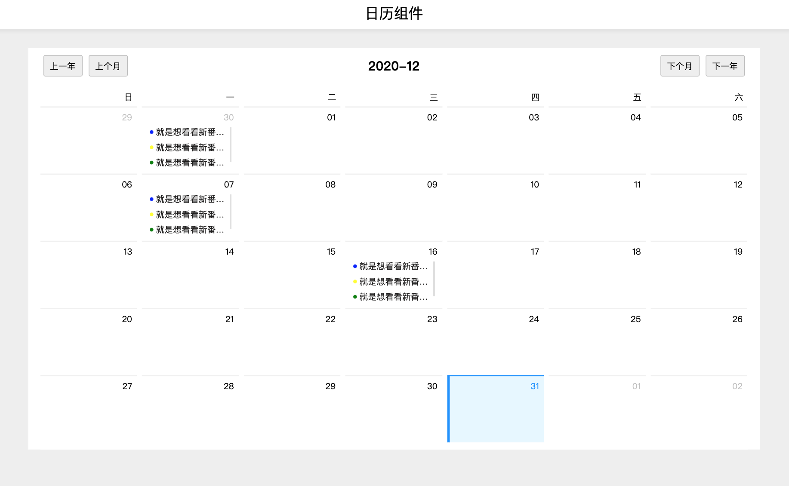
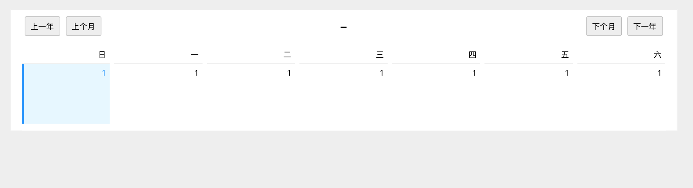

## 2020-12-31 原生JS实现日历

[[toc]]


### Step 0：背景介绍

在平时开发过程中，我们经常会使用第三方的UI组件库来帮助我们快速完成工作开发的需求，但是有些场景下我们也不得不应对UI设计日历组件用三方库也无法理解满足需求，这时候了解日历的基本实现应对这些需求也不会很慌了，大不了就自己实现一个😆

::: tip

本文中日历采用原生js开发，无需任何三方依赖包(顺带也算好好回顾下快忘记的原生开发，毕竟框架用多了。。)，后面自己集成到`vue`或者`react`也十分方便

:::

### Step 1： 前置知识

> 在开发日历组件前，我们需要了解一个前置知识，就是JavaScript的内置对象`Date`，我们需要了解它内部的方法属性才能进行下一步操作。


```javascript
// 实例化Date
const now = new Date()
// 在控制台中打印now会得到如下的信息
'Thu Dec 31 2020 18:02:15 GMT+0800 (中国标准时间)'
// 其实now会执行 才会有以下内容
now[Symbol.toPrimitive]('default')
'Thu Dec 31 2020 18:02:15 GMT+0800 (中国标准时间)'

// 获取年
now.getFullYear()
// 获取月 需要注意的是，js对月的实现返回值是从0-11即0->1月，11-> 12月
now.getMonth()
// 获取日
now.getDate()
// 获取星期 星期的排列稍微有点差异就是周日对应的值是0，其他星期都是正常
// [0,1,2,3,4,5,6] => ['星期日','星期一','星期二','星期三','星期四','星期五','星期六']
now.getDay()

// 设置年份
now.setFullYear()
// 设置月份
now.setMonth()
// 设置日期
now.setDate()
// 以上几个api就够我们开发日历组件的了
```

[更多的api内容请点此](https://developer.mozilla.org/en-US/docs/Web/JavaScript/Reference/Global_Objects/Date)

::: warning
这里思考一个问题🤔，我们在做日历的时候肯定会遇到一个问题，那就是怎么知道当年展示的这个月份的天数呢？毕竟每个月天数都是不一定的，有31，30，29，28天，试着结合上面几个api想想该如何解决这个问题？带着这个问题我们先进入下面的step吧！
:::

### Step 2： 需求简单分析
先看下实现的简单的界面吧，如下图所示



分析下日历组件的基本功能

- 展示当前月份的所有日期+上个月的尾巴+下个月的头几天，显示样式不同（日历的主要构成）
- 日期从周日周一。。排列
- header上展示当前展示的年-月份
- 点击header栏的按钮可以切换前后月份，前后年份
- 点击日期选中，如果点中的日期不属于当前月，切换到点击的月份上
- 每一个格子内可以填充内容
- 给今天做特殊标记
- 。。。

简单分析了下所需要实现的功能，下一步我们实现下布局


### Step 3：布局实现
创建如下目录
```
├──demo
├──--js
├──--├──index.js
├──--├──api.js
├──--css
├──--├──index.less
├──--index.html
```
> 这里为了方便书写css，笔者使用了less预处理器，也算偷个懒，只需要引入less.js就可以方便的书写less了

```js
<script src="//cdn.jsdelivr.net/npm/less@3.13"></script>
```

接下来先画html骨架

```html
<div class="calendar-wrap">
            <div class="calendar-header">
                <div class="calendar-header-content">
                    <span class="calendar-header-dir calendar-header-left" data-year="-1">上一年</span>
                    <span class="calendar-header-dir calendar-header-left" data-month="-1">上个月</span>
                    <h2 id="calendar-headar-titile">-</h2>
                    <span class="calendar-header-dir calendar-header-right" data-month="1">下个月</span>
                    <span class="calendar-header-dir calendar-header-right" data-year="1">下一年</span>
                </div>
            </div>
            <div class="calendar-panel">
                <div class="calendar-date-panel">
                    <div class="calendar-date-body">
                        <div class="calendar-date-content">
                            <div class="calendar-date-header">
                                <div class="calendar-item">日</div>
                                <div class="calendar-item">一</div>
                                <div class="calendar-item">二</div>
                                <div class="calendar-item">三</div>
                                <div class="calendar-item">四</div>
                                <div class="calendar-item">五</div>
                                <div class="calendar-item">六</div>
                            </div>
                            <div class="calendar-date-tbody-content">
                              <div class="calendar-date-tbody">
                                  <div class="calendar-item active">
                                      <div class="calendar-item-header">1</div>
                                      <div class="calendar-item-content"></div>
                                  </div>
                                  <div class="calendar-item">
                                      <div class="calendar-item-header">1</div>
                                      <div class="calendar-item-content"></div>
                                  </div>
                                  <div class="calendar-item">
                                      <div class="calendar-item-header">1</div>
                                      <div class="calendar-item-content"></div>
                                  </div>
                                  <div class="calendar-item">
                                      <div class="calendar-item-header">1</div>
                                      <div class="calendar-item-content"></div>
                                  </div>
                                  <div class="calendar-item">
                                      <div class="calendar-item-header">1</div>
                                      <div class="calendar-item-content"></div>
                                  </div>
                                  <div class="calendar-item">
                                      <div class="calendar-item-header">1</div>
                                      <div class="calendar-item-content"></div>
                                  </div>
                                  <div class="calendar-item">
                                      <div class="calendar-item-header">1</div>
                                      <div class="calendar-item-content"></div>
                                  </div>
                              </div>
                            </div>
                        </div>
                    </div>
                </div>
            </div>
        </div>
```

Css 方面笔者使用grid布局去做了主体的实现

```less
.calendar-date-tbody {
    display: grid;
  	// 设置7列，每列平分总体宽度
    grid-template-columns: repeat(7, 1fr);
    // 每个grid行的空隙
  	grid-row-gap: 8px;
  	// 每个grid和列的空隙
    grid-column-gap: 8px;
    text-align: right;
    & > .calendar-item {
      position: relative;
      transition: all .3s;
      display: block;
      padding: 4px 8px 0;
      min-width: 24px;
      width: 100%;
      border-top: 2px solid rgb(240,240,240);
      cursor: pointer;
      &:hover {
        background: rgba(238, 238, 238, 0.6);
      }
      &.calendar-item-before-month, &.calendar-item-after-month {
        color: rgba(0, 0, 0, 0.25);
      }
      // 设置点击后显示的active样式
      &.active {
        background: var(--theme-opacity-lower-color);
        color: var(--theme-color);
      }
      // 今天的active样式
      &.now-active {
        border-color: var(--theme-color);
        color: var(--theme-color);
      }
      .calendar-item-header {
        line-height: 24px;
      }
      .calendar-item-content {
        height: 80px;
        overflow-x: hidden;
        overflow-y: auto;
        text-align: left;
      }
    }
  }
}
```

不出意外，可以得到如下所示的图



**但是，其实每个人都有自己对css理解，这部分其实不是很重要，只要能做出相同的效果就可以了，这里贴得代码仅供参考~**

### Step 4：主体功能实现

> 还记得我们上面提到的问题吗？怎么去获取当前月份的天数呢？其实只要能解决了这个问题，我们最大的问题就迎刃而解了

这里还得啰嗦一句，关于Date实例的对象问题

```js
const now = new Date()
// 这里实例化的对象其实算是引用类型，千万要注意传递参数时，改变这个对象的后果
// 比如如下 这样修改后now值就被改变了，所有使用它的地方，都会发生变换
now.setDate(1)

function setNewDate(date, addNum) {
  // 外面传入的date也会变
  date.setDate(addNum)
}

// 当当前月有31天且日期是31号而上个月有30天的时候
// 比如今天是12月31日
const now = new Date()
// 把月份设置为11月
now.setMonth(10)

// 这个时候，其实now.getMonth()还是12月
// 因为把当前月设置为11月时，11没有31号，设置失败，导致月份还是显示的12月，你可以试试下面的例子
const now = new Date('2020/12/31')
now.setMonth(10)
now.getMonth()
```

接下来我们来解决下算月份天数的问题，我们这样想，其实只需要把当前月加1并设置为下月的1号再减1，这样就可以算出当前月的最后一天是几号了，这么说可能还不直观

```js
// 举个例子
// 2020-12-28 增加一个月并设置为当前月的1号 就变成了 -> 2021-01-01 
// 接下来再减去一天就能得到 -> 2020-12-31 我们用代码实现下

let currentDate = new Date()
// 设置为一下月的第一天
currentDate.setMonth(currentDate.getMonth() + 1, 1)
// 获取到的当前日期的最后一天
currentDate.setDate(currentDate.getDate() - 1)

// 是不是很简单？
```

接下里我们实现下这个获取整个月的函数

```js
**
 * 根据传入的时间，获取传入时间的开始日期到结束日期
 * @param {*} date 
 */
export function getDaysByMonth (date) {
    // 避免date引用
    let currentDate = new Date(date)
    // 设置为一下月的第一天
    currentDate.setMonth(currentDate.getMonth() + 1, 1)
    // 获取到的当前日期的最后一天
    currentDate.setDate(currentDate.getDate() - 1)

    const lastDate = currentDate.getDate()
    let result = []
    for (let i = 1; i <= lastDate; i++) {
        let scopeDate = new Date(currentDate.setDate(i))
        
        const formateDate = format(scopeDate)
        const element = {
            date: scopeDate,
            formateDate,
            year: formateDate.split('-')[0],
            month: formateDate.split('-')[1],
            day: formateDate.split('-')[2]
        }
        result = [...result, element]
    }
    return result
}
```

下面我们需要获取上下三个月的日期

```js
// totalCount 为默认填满6个周期 6 * 7
export function getTotalDate(date, totalCount = 42) {
    const nowDate = date ? new Date(date) : new Date()
    
    const beforeMonth = new Date(nowDate).setMonth(nowDate.getMonth() - 1, 1)
    const nowMonth = new Date(nowDate).setMonth(nowDate.getMonth(), 1)
    const afterMonth = new Date(nowDate).setMonth(nowDate.getMonth() + 1, 1)

    const beforeDates = getDaysByMonth(beforeMonth)
    const nowDates = getDaysByMonth(nowMonth)
    const afterDates = getDaysByMonth(afterMonth)

    return [...beforeDates, ...nowDates, ...afterDates]
}
```

但是这么干，会返回起码接近90+的日期，这不是我们需要的，为此我们需要过虑前后两个月的日子，去除大部分不需要展示在日历上的日子。

| 周日 | 周一 | 周二 | 周三 | 周四 | 周五 | 周六 |
| ---- | ---- | ---- | ---- | ---- | ---- | ---- |
| 0\|7 | 1    | 2    | 3    | 4    | 5    | 6    |

看上面的表格第一格是周末，对应我们`date.getDay() = 0`的情况，我们可以这样假设，默认最大的总格子数为42格，6周，基本是我们考虑最多的日子的情况。

然后我们会发现一个规律

- 当当前月份1号为周末的时候，刚好顶格显示，不需要上个月内容

- 当当前月份1号为周1的时候，上个月需要1天
- 当当前月份1号为周2的时候，上个月需要2天
- 。。。

我们可以给出`beforeDates.slice(beforeDates.length - 当前月的1号的getDay(), beforeDates.length)`

剩下的日子我们假定为`42 - beforeDates.length - 当前月的1号的getDay()`，这是如果满格42格情况下，下月填充的日子数量，其实一般做到这直接取这个数量的下个月日子就行了，但是我们想要尽可能少的内容，我们就得继续判断接下来的日子规律：

如果填充的数量超过7的话，我们直接不要了，7以内的都要，就刚好符合我们的要求，为此我们只需要把剩下的日子对7取余就好了。

ok，解决完毕这些小问题，完善下我们的函数如下

```js
export function getTotalDate(date, totalCount = 42) {
    const nowDate = date ? new Date(date) : new Date()
    
    const beforeMonth = new Date(nowDate).setMonth(nowDate.getMonth() - 1, 1)
    const nowMonth = new Date(nowDate).setMonth(nowDate.getMonth(), 1)
    const afterMonth = new Date(nowDate).setMonth(nowDate.getMonth() + 1, 1)

    const beforeDates = getDaysByMonth(beforeMonth)
    const nowDates = getDaysByMonth(nowMonth)
    const afterDates = getDaysByMonth(afterMonth)

    const remain = totalCount - nowDates.length
    const header = nowDates[0].date.getDay()
    const end = remain - header

    return [...(beforeDates.slice(beforeDates.length - header, beforeDates.length)), ...nowDates, ...(afterDates.slice(0, end % 7))]
}
```

这样我们的数据就取完整了，还没有多余的东西，完美！

### Step 5：Dom功能补全

这里就是不全dom操作的功能了，直接贴代码

```js
window.onload = () => {
	init()
}
// 设置一个全局的Date()实例
const now = new Date()
const content = document.querySelector(".calendar-date-tbody-content")

function init() {
  // 获取所需的日期数据
	const totalDate = getTotalDate(now)
	initDom(totalDate)
}

function initDom(totalDate) {
	const result = []
	const divs = document.createDocumentFragment()
	let i = 0
	const total7Count = totalDate.length / 7
	const remain7Count = totalDate.length % 7
  // 这里呢，我们设置一个result的二维数组，里面每个元素都有7个日期方便渲染
	while (total7Count >= i) {
		if (total7Count === i) {
			remain7Count > 0 && (result[i] = totalDate.slice(i * 7, totalDate.length))
		} else {
			result[i] = totalDate.slice(i * 7, (i + 1) * 7)
		}
		i++
	}
	// 遍历二维数组
	result.forEach((f) => {
    // 组出一个week
		const d = combineDiv(f)
		divs.appendChild(d)
	})

	content.innerHTML = ""
  // 添加到页面上
	content.appendChild(divs)
}
// 拼接dom
function combineDiv(f) {
	// 父节点
	const fDiv = document.createElement("div")
	fDiv.className = "calendar-date-tbody"

	let el = ""
	f.forEach((e) => {
		const { formateDate, month } = e
		const nowDate = format(now)
		const className = ["calendar-item"]

		el += `<div class="${className.join(" ")}" id="${formateDate}" data-year="${e.year}" data-month="${e.month}">
                                    <div class="calendar-item-header">${e.day}</div>
                                    <div class="calendar-item-content">
                                    </div>
                                </div>`
	})
	fDiv.innerHTML = el

	return fDiv
}
```


### Step 6：事件补全

这里我们绑定header上点击切换前后年月的按钮

```js
const dir = document.querySelector(".calendar-header-content")

dir.removeEventListener("click", initFunc)
dir.addEventListener("click", initFunc)

// 切换年月的事件，这里面没什么特别要说明的
function initFunc(e) {
	const { target } = e
	if (target.classList.contains("calendar-header-dir")) {
		let { month = 0, year = 0 } = target.dataset
		now.setMonth(now.getMonth() + +month, 1)
		now.setFullYear(now.getFullYear() + +year)
		init()
	}
}
```

绑定点击日期的事件，我们直接代理到外层父级上

```js
content.removeEventListener("click", initDateFunc)
content.addEventListener("click", initDateFunc)
let selected = format(now) // 'yyyy-MM-dd'
function initDateFunc(e) {
  // 这里一个帮助函数，获取点击内容的父级
	const target = getElementByClassName(e.target, "calendar-item")
	if (target) {
		const id = target.id
		// 一个全局变量 帮助判断active的状态，是不是在当前节点上
		if (selected === id) {
			return
		}
		// 如果当前月份不等于点击的月份，我们需要重新渲染dom
		let { month, year } = target.dataset
		month = month - 1

		if (now.getMonth() !== month) {
			now.setMonth(month, 1)
			now.setFullYear(year)
			init()
		}
		// 切换active状态
		document.getElementById(`${id}`).classList.add("active")
		const activeElement = document.getElementById(`${selected}`)
		activeElement && activeElement.classList.remove("active")
		selected = id
	}
}

```

这样我们的功能基本就全部完成了


### Step 7...

**完成了以上功能其实只是个开始，这个日历组件可以改造成vue,react框架的组件，方便我们以后拓展更多功能，这个日历只是实现了一个日历的基本功能而已，更远的路在等着我们。。。**