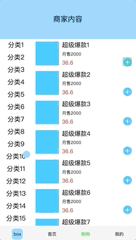
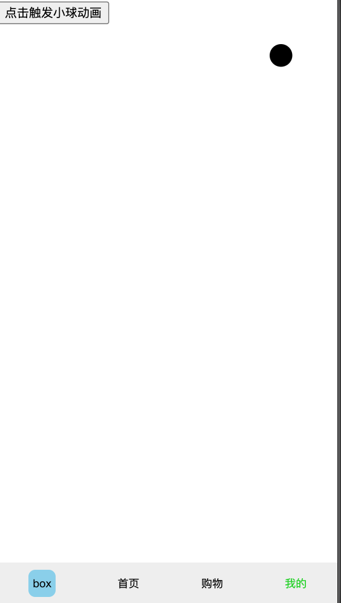
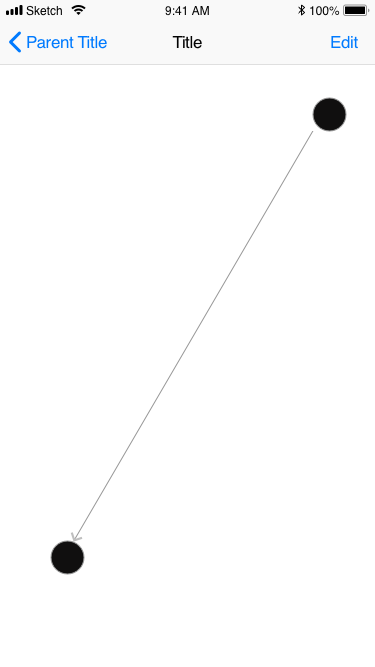
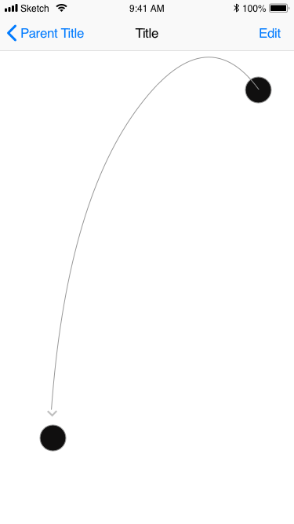
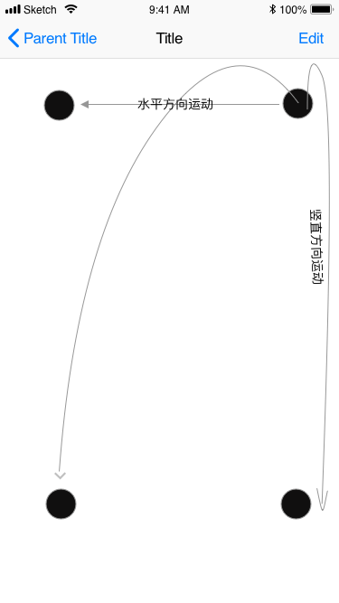
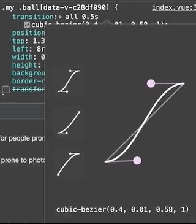
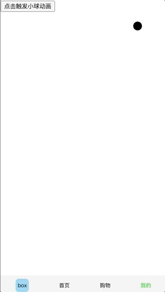
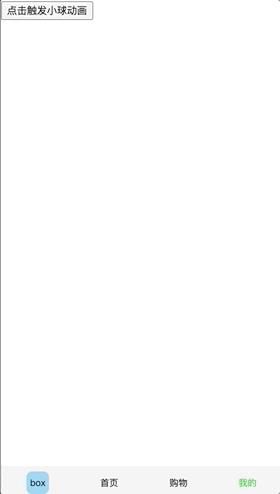

### 2021-1-15 实现小球落袋的效果

> 这个问题是来自于笔者10月面试题里面的一道题（涂鸦智能的面试）印象还比较深刻，当时是电话面试问的实现思路，回答的不太好，没把具体实现思路讲出来，所以就有了现在篇<span style="text-decoration: line-through;">水</span>文章😂，接下来的文章也会穿插这类面试题的实现。

#### 根据具体场景分析

首先还是让我们先看看大家常用的饿了么里面添加外卖时候的小球动画吧，然后再来分析分析具体的细节，上图



我们可以看到，**小球的落下轨迹是个弧形的，点击触发小球运动，小球会随着设定的过渡效果落到左下角固定位置**，至此简短的小动画效果就结束了。

然后我们来进行对着刚才的描述和图片进行分析下，这个效果到底是怎么实现的，大概的思路如下

- 预先创建好一个`dom`节点并设置不可见，给`dom`设置一个预先设计好的过渡效果
- 点击的时候显示这个`dom`，并记录下点击的时候鼠标/手指的位置信息
- 获取掉落的目标`targetDom`的位置信息，给显示的`dom`设置最终的位置
- 运动结束后，隐藏该`dom`

大概就这么先粗略的设想下，看到这里，小脑瓜一想肯定手到擒来！不过总得从先实现简单的效果开始，<u>**这里我们就假定这个小球就是显示的，抛去点击的过程，目标位置也是固定不动，简化步骤，点击一个按钮然后就执行这个落袋的效**</u>。好了，那就开始干吧！


#### 开发环境搭建

这里可以随意使用自己熟悉的脚手架工具来做比如`vue-cli`又或者`vite`又或者`create-react-app`,这次我使用`vue`来实现，不过用`react`问题也不大，随心就好。脚手架笔者这边随意搭了一套`webpack5`的，各位看官就还是尽量用`webpack4`，5版本的生态还没完全升上来。

大体结构如下所示

```text
.
├─ src
│  ├─ page
│  │├─ home
│  │  └─ index.vue
│  │├─ my
│  │  └─ index.vue // 测试页面
│  │└─ store
│  │  └─ index.vue // 实际页面
│  ├─ router
│  └─ App.vue
...
```


#### 测试页面编写

测试页面比较简单，大概就长这样，如下图



先固定小球位置在右上角，点击触发后让小球运动到左下角，实现代码如下

```vue
<template>
    <div class="my">
        <div :class="['ball', {'active' : flag}]">
        </div>
        <button @click="choose">点击触发小球动画</button>
    </div>
</template>

<script>
    export default {
        data() {
            return {
                flag: false
            }
        },
        methods: {
            choose() {
                this.flag = !this.flag
            }
        }
    }
</script>

<style lang="less" scoped>
    .my {
        height: 100%;

        .ball {
            position: absolute;
            top: 100px;
            left: 600px;
            width: 50px;
            height: 50px;
            background: #000;
            border-radius: 50%;

            &.active {
                top: 1100px;
                left: 100px;
            }
        }
    }
</style>
```

这样我们就完成了一个简单的demo，点击后当然也没运动效果（主要也没加过渡效果。。），点击后就是小球的位置切换，很生硬，接下来我们给它加点过渡效果上去

```less
// 这样假如过渡效果后，我们能看到小球只能做一个斜线运动，并没有抛物体的运动
.ball {
  transition: all .5s;
}
```

也就是如下图所示的



而我们希望能得到的最终效果如下



所以我们需要把这个运动过程进行拆解，初中物理里面有两个知识点`自由落体`和`抛物线`，默认一切都没有摩擦力和空气阻力的情况下：

- `自由落体`就是一个方向受力即重力，自上而下运动，这好比我们刚才实现的效果，其实也算自由落体，但速度是恒定的，没有重力的概念，所以它只能朝一个方向运动
- `抛物线运动`则是由两个方向的力组成，横向的力与纵向的重力，让物体形成了抛物线

然后我们就知道接下来要怎么做了，就是把运动进行分解，得到



- 设水平方向坐标x0 -> x1，过渡效果就是线性的`linear`
- 设竖直方向坐标y0 -> y1，过渡效果用贝塞尔曲线去设一个值

从谷歌浏览器里面随便拉个效果出来，如图，我们从中取个值`cubic-bezier(.19,-0.14,.82,0)`



当然也可以从去[网站](https://cubic-bezier.com/#.17,.67,.83,.67)找下

接下来我们重新设计下`dom`结构

```vue
<template>
    <div class="my">
        <div :class="['ball', {'active' : flag}]">
            <div class="inner"></div>
        </div>
        <button @click="choose">点击触发小球动画</button>
    </div>
</template>
```

`css`代码也改下

```less
.ball {
  transition: all .5s cubic-bezier(.19,-0.14,.82,0);
  position: absolute;
  top: 100px;

  &.active {
    top: 1100px;
    .inner {
      left: 100px;
    }
  }

  .inner {
    transition: all .5s linear;
    position: absolute;
    left: 600px;
    width: 40px;
    height: 40px;
    border-radius: 50%;
    background: #000;
  }
}
```

这样我们就得到了所想要的测试效果



一个简单的小例子就这样实现了，下面再把前面省略的两步给加上


#### 完整的demo实现

我们就直接通过点击按钮来再显示上面的这段动画吧，小球默认隐藏并去掉active的className

```vue
<div :class="['ball']" ref="ball" v-show="flag">
  <div class="inner"></div>
</div>
<script>
    export default {
        data() {
            return {
                flag: false
            }
        },
        methods: {
            ...less,
            choose() {
                this.$refs.ball.style.top = `${50}px`
                this.$refs.ball.children[0].style.left = `${300}px`
                this.flag = true
								// 等待dom更新后的操作
                this.$nextTick(() => {
                    this.$refs.ball.style.top = `${505}px`
                    this.$refs.ball.children[0].style.left = `${50}px`
                })
            },
            transitionEnd(e) {
              // 这里会触发两次，因为父子层级都有transition
                console.log(e)
                if (e.target.classList.contains('inner')) {
                    this.flag = false
                }
            }
        },
        beforeDestroy() {
            this.$refs.ball.removeEventListener('transitionend', this.transitionEnd, false)
        },
        mounted() {
          	// 这里监听transitionend事件
            this.$refs.ball.addEventListener('transitionend', this.transitionEnd, false)
        }
    }
</script>
```

```less
.ball {
  position: absolute;
  transition: all .5s cubic-bezier(.19, -0.14, .82, 0);

  .inner {
    position: absolute;
    transition: all .5s linear;
    width: 40px;
    height: 40px;
    border-radius: 50%;
    background: #000;
  }
```

然后就得到了如下的效果



这样我们的一个小demo完成了，在实际开发里面，我们可以依赖vue的transition来做，这样代码逻辑会更清晰，然后可以通过父子组件通信的方式，传递到父层来做这个效果。


#### 通过vue-transition组件来完成一个仿饿了么的小球动画效果

这里我们需要依赖下transition的几个钩子函数

```vue
<transition v-on:before-enter="beforeEnter"
            v-on:after-enter="afterEnter"
            v-bind:css="false"
            v-on:enter="enter">
  ...
</transition>
```

`before-enter`、`after-enter`和`enter`，具体可以参考vue官网

methods部分如下

```js
export default {
  data() {
    return {
      flag: false
    }
  },
  methods: {
    // 子组件点击事件，传递的是点击时候的target对象
    addBar(target) {
      this.tar = target.getBoundingClientRect()
      // this.$nextTick(() => {
        this.flag = true
      // })
    },
    beforeEnter: function (el) {
      el.style.transform = `translate3d(0, ${this.tar.y}px, 0)`
      el.children[0].style.transform = `translate3d(${this.tar.x}px, 0, 0)`
    },
    enter: function (el, done) {
      // 使用强制重绘，防止浏览器优化重排，导致只出现最后一刻的显示
      // 强制重绘会让渲染引擎重绘当前界面后继续后面的逻辑
      const rp = el.clientHeight
      this.$nextTick(() => {
        el.style.transform = `translate3d(0, ${this.box.y}px, 0)`
        el.children[0].style.transform = `translate3d(${this.box.x}px, 0, 0)`
        done()
      })
    },
    afterEnter() {
      setTimeout(() => {
        this.flag = false
      }, 520)
    }
  },
  mounted() {
    this.tar = null
    // 这个是掉落的终点位置dom
    this.box = this.$refs.box.getBoundingClientRect()
    // 这里监听子组件的点击事件
    bus.$off('addBar').$on('addBar', this.addBar)
  }
}
```

这里面主要疑惑的点应该就是下面这句

```js
const rp = el.clientHeight
```

理由也写在上面了，主要还是因为浏览器会优化repaint，合并只展示最后一次的绘制效果，这里有个参考链接给大家看下[链接](https://segmentfault.com/q/1010000006771100)

还有就是为何我用了`transform`去替代`position`

**理由的话经常刷面试题的各位肯定都知道`transform:translate3d()`不会一直repaint，而且在手机端还能引起GPU加速，这是面试的考点必须得知道，而position问题就在这里，我们用浏览器内置的开发者工具->选择`Rendering`选项卡->勾选`paint flashing` 然后再来执行代码就能看到效果了**

1.这是`position`的运行效果


2.这是`translate3d`的效果


上图用的是vue的transition组件做的，`paint flashing` 开启后一眼就能看出差别所在。


#### 结尾

到这里，这个面试题算是完成的中规中矩了吧，下次遇到应该不会再出问题了😭！不过里面还是留了些坑，后续还得完善下。

> 留下问题，现在是一个小球，当点击按钮的时候只能等待当前动画结束后，再次点击按钮才会重新执行落袋效果，该怎么改才能达到连续落袋效果呢🤔？

