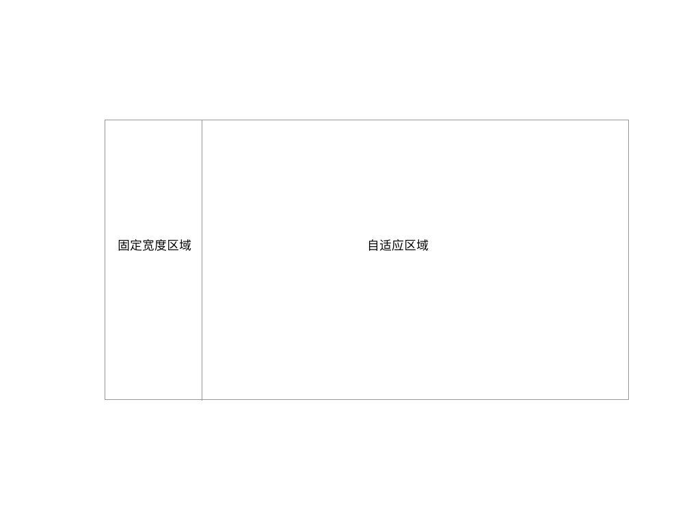
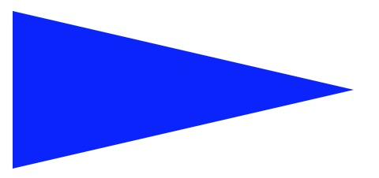
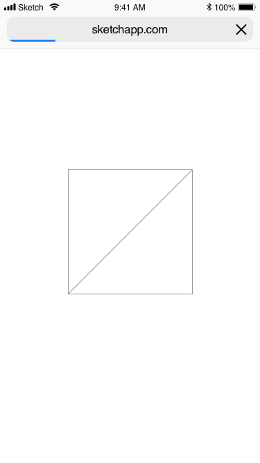
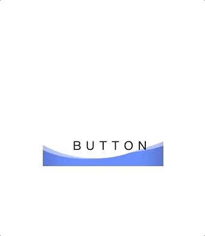
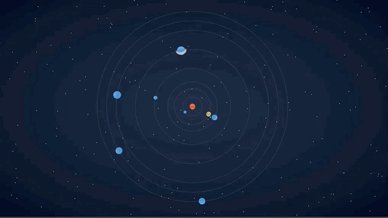

###  2021-1-31  教你用CSS解决一些面试问题

> css在现阶段的前端面试中占得比重确实低，有些公司甚至都只是一笔带过。但作为一个合格的前端开发，css其实还是挺重要的，本人在面试别人的时候，总是要提及一些css问题，考察面试者基本的布局能力或者其他的一些小想法

以下是一些比较常问的问题，包括本人会问候选人和被问的题，各位有兴趣的话可以看看，试着实现下，前面会放问题和问题的一些简述，后面会给一些实现的具体代码；**不赶时间的话，先试着去想象怎么解决问题，再去看下实现的代码，加深下自己的印象**。

废话说了这么多，请看题目吧：

### 1.用css实现一个两栏布局



实话说，这道题目看似简单，但是可考察的内容很多，一个简单的后台管理系统基本都是这种类型的布局方式，而且可以用来实现的方式也很多，能够考察候选人的css基本使用能力与css技术的了解程度。

但就我自己做面试官出这题，很多时候得到的结果都比较令人心酸。候选人要么答不上来（框架用多了，只会说`elementUI`或者`antd`里面的栅格布局），要么只答上来一两种！***千万不要对着框架开发。。。这样最多只是个框架使用者，脱离框架啥都不会了。。***

<div style="height: 50px"></div>

###  2.用css实现一个三角形

这题目简直刷题必看的，其实也没啥好说的，但是为了凑题目还是放进去吧(手动狗头)。

<div style="border: 1px dashed #000;padding: 20px">
*三角形.png * 各位脑补画面
</div>


#### 这题引申下，怎么实现一个这样的等腰三角形



#### 这题目还能再引申下，怎么实现一面五星红旗（我都是先问这个，看候选人答不上才会说三角形的问题）

实现效果如下：


红旗代码各位自行实现吧，不给实现代码了(狗头)`（若真需要，请私信我公众号，看到我会回复的）`

#### 3.用css实现一个正方形，当然不能用width、heigth去设置宽高

说了三角形就不能不说正方形了，当然使用宽高来实现感觉容易被人打，想想怎么不用宽高来实现。

<div style="height: 50px"></div>

#### 4.实现如下图形



这题其实最开始是来自我网上看到的，就这么实现一个简单的图形，当然，只能使用一个元素`eg:<div>`


#### 5.实现如下图形



波浪效果的实现，`hover`上去之后会慢慢涨潮填满整个`button`元素


<div style="border: 1px dashed #000;">
	<h3> &nbsp;&nbsp;&nbsp;&nbsp;代码实现部分</h3>
</div>


#### 第一题

两栏布局的实现方式其实挺多，这里就列举下本人了解的六种方式

通用css如下

```css
* {
  margin: 0;
  padding: 0;
}
.main {
  height: 50px;
}
.left {
  width: 200px;
  height: 50px;
  background: skyblue;
}
.right {
  height: 50px;
  background: slateblue;
}
```

1. 第一种`inline-block`方式

```html
<div class="main block">
  <div class="left">左边</div>
  <div class="right">右边</div>
</div>
<style>
  /* 特别注意inline-block之间的间隙问题，得处理下 */
  .block {
    font-size: 0;
  }
  .block > .left {
    display: inline-block;
    font-size: 14px;
  }
  .block > .right {
    display: inline-block;
    width: calc(100% - 200px);
    font-size: 14px;
  }
</style>
```

2. 第二种`float`方式

```html
<div class="main float">
  <div class="left">左边</div>
  <div class="right">右边</div>
</div>
<style>
  /* 注意浮动的问题（BFC），会在回答这种解法的时候追问 */
  .float > .left {
    float: left;
  }
</style>
```

3. 第三种`position`方式

```html
<div class="main position">
  <div class="left">左边</div>
  <div class="right">右边</div>
</div>
<style>
  .position {
    position: relative;
  }
  .position > .left, .position >.right {
    position: absolute;
  }
  .position > .left {
    left: 0;
  }
  .position > .right {
    left: 200px;
    right: 0;
    top: 0;
    bottom: 0;
  }
</style>
```

4. 第四种`table`方式

```html
<div class="main table">
  <div class="left">左边</div>
  <div class="right">右边</div>
</div>
<style>
  /* 注意table默认不会撑满width的问题 */
  .table {
    display: table;
    width: 100%;
  }
  .table > .left, .table >.right {
    display: table-cell;
  }
</style>
```

5. 第五种`flex`方式

```html
 <div class="main flex">
   <div class="left">左边</div>
   <div class="right">右边</div>
</div>
<style>
  .flex {
    display: flex;
  }
  /* 会顺势追问flex的意思 */
  .flex > .right {
    flex: 1;
  }
</style>
```

6. 第六种`gird`方式

```html
 <div class="main grid">
   <div class="left">左边</div>
   <div class="right">右边</div>
</div>
<style>
  .grid {
    margin-top: 20px;
    display: grid;
    grid-template-columns: 200px auto;
  }
</style>
```

ok，这里就列举完毕了，回答出多种布局一般还会追问这些布局的优劣势，各位可以思考下


#### 第二题

```html
<div class="triangle">
</div>
```

```css
/* 三角形定点朝向→ */
.triangle {
  width: 0;
  height: 0;
  border-width: 100px;
  border-style: solid;
  border-color: transparent transparent transparent blue;
}
```

图中三角形的朝向都是通过`border-color`的设置有关

`border-color:top right bottom left `,你想要定点朝向哪里，就设置对应的边颜色就行

- 朝↓ `border-color: blue transparent transparent transparent;`
- 朝←`border-color: transparent blue transparent transparent;`
- 朝↑`border-color: transparent transparent blue transparent;`
- 朝→`border-color: transparent transparent transparent blue;`


**第二题的引申，更加长的等腰三角形**


实现的话还是简单，只需要把显示的这块border拉长就好

```css
/* 三角形定点朝向→ */
.triangle {
  width: 0;
  height: 0;
  border-width: 50px;
  border-left-width: 200px;
  border-style: solid;
  border-color: transparent transparent transparent blue;
}
```

<div style="font-size: 12px">（五星红旗的引申，如有需要可以问公众号）</div>

#### 第三题

正方形的实现，其实和三角形有点关系的，各位想想，如果不给三角形设置`transparent`会是什么样子呢？

是不是就是个正方形😆

```css
.square {
  width: 0;
  height: 0;
  border-width: 50px;
  border-style: solid;
  border-color: #000;
}
```

还有一种方式，就是这是padding就行了，有没有想到过？

```css
.square {
  width: 0;
  height: 0;
  padding: 100px;
}
```

显示不了？那当然，你得设置背景色啊！！！


#### 第四题

思路1：是可以通过伪元素然后旋转来做代码如下

```html
<div><div>
<style>
  div {
    position: relative;
    width: 300px;
    height: 300px;
    border: 1px solid #000;
    overflow: hidden;
  }

  div::before {
    position: absolute;
    top: -50%;
    left: 50%;
    content: ' ';
    display: block;
    width: 1px;
    height: 200%;
    background: #000;
    transform: rotate(45deg);
  }  
</style>
```

思路2：通过背景色线性渐变来做

```html
<div><div>
<style>
  div {
    width: 300px;
    height: 300px;
    border: 1px solid #000;
    background: linear-gradient(135deg, #fff 50%, #000 50%, #fff calc(50% + 1px), #fff);
  }
</style>
```

#### 第五题
这里的技巧其实是用的障眼法来实现的
来看下实现的代码就知道了

```html
<a class="wave">
  <span>button</span>
  <div class="wave-content">
  </div>
</a>
<style>
  .wave {
    position: relative;
    width: 200px;
    height: 60px;
    line-height: 60px;
    text-align: center;
    background: blue;
    color: #ffffff;
  }

  .wave-content {
    transition: all 1s;
    position: absolute;
    left: 0;
    top: -60px;
    width: 100%;
    height: 200px;
    z-index: 1;
  }

  .wave-content:hover {
    top: -120px;
  }

  span {
    position: relative;
    z-index: 3;
    color: #000;
  }

  .wave-content::before, .wave-content::after {
    position: absolute;
    left: 50%;
    top: 0;
    content: ' ';
    width: 200%;
    height: 200%;
  }

  .wave-content::before {
    border-radius: 45%;
    background: #fff;
    animation: circle 5s infinite linear;
  }

  .wave-content::after {
    border-radius: 40%;
    background: rgba(255, 255, 255, 0.5);
    animation: circle 10s infinite linear;
  }


  @keyframes circle {
    0% {
      transform: translate(-50%, -75%) rotate(0);
    }

    100% {
      transform: translate(-50%, -75%) rotate(360deg);
    }
  }
</style>
```

这里实现的逻辑比较简单，其实主要用的两个正方形并给与一定的`border-radius`，来遮挡`button`的颜色


到这里本篇文章就这样结束了，希望能对你有所帮助！

<div style="height: 30px"></div>

#### 拓展题：思考题如下所示用css实现



题目要求如题所示，用纯css实现，没有实现代码，之前在同事那边了解的一道题，各位有兴趣实现下，后面看情况会出下这个实现的文章。


##### 最后的最后，谢谢看到最后的你！2021一起加油！

