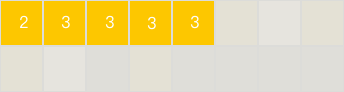
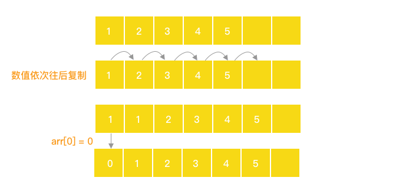

### 2-28 学习数据结构与算法 By JS：数组

#### 前言

数组是js中的简单的内存数据结构，它在内存中是连续的,如下图所示；



```js
const array = [2,3,3,3,3]
// 每一个元素都有一个唯一的下标,从0开始
// 2 3 3 3 3...
// 0 1 2 3 4...
```

在强类型语言数组一般只支持同一类型变量进行存储，但js的数组可以存不同类型的变量，我们应当尽量保证数组内的元素类型一致；

```js
// 类似typescript中的元组的概念（Tuple）
// 即在数组中存储了不同类型的变量
const array = ['string', 123, {a: 1,b: 2}, [1]]
```

#### 数组的基本使用

```js
// 创建数组的方式
// 1.
const array = []
const array = ['a','b','c']
// 2.
const array = new Array()
const array = new Array('a','b','c') // -> ['a','b','c']
// 如果只传一个数字，那么会创建数字对应个数的空数组
const array = new Array(1) // -> [empty x 1] array.length 为 1
// 如果传多个数字，则直接输出为对应的数组
const array = new Array(1,2 ) // -> [1, 2] array.length 为 2
```

###### 其他场景

- 假如我们要记录一周气温的变化就可以直接用数组展示

```js
const list = ['24℃','23℃','22℃','21℃','20℃','19℃','18℃']
```

- 假如我们需要统计一个3行3列的方阵

```js
// 可以创建一个二维数组
const rows = [
  [1,2,3,4,5], 
  [6,7,8,9,10],
  [11,12,13,14,15],
]
```

- 当然也有更多维的数组，比如要描述一个3阶模仿

```js
// 创建三维数组
const cube = [
  [
    [1,2,3]
  ],
   [
    [4,5,6]
  ],
   [
    [7,8,9]
  ]
]
// 遍历这个cube
for(let i = 0;i < cube.length; i++) {
  const rows = cube[i]
  for(let j = 0;j < rows.length; j++) {
    const columns = rows[j]
    for(let z = 0;z < columns.length; z++) {
			console.log(columns[z])
    }
	}
}
```


#### 数组的读取
```js
// 读取相对简单，只需要拿到对应元素的下标即可
const array = [1,2,3]
array[0] // -> 1
array[1] // -> 2
array[2] // -> 3
// 当然不存在的也能获取，只是会返回undefined
array[999] // -> 返回undefined
```


#### 数组的新增

- 尾部新增

```js
let array = [1,2]
array.push(3) // -> [1,2,3]
// or
array.push(4,5,6) // -> [1,2,3,4,5,6]
// or
array[array.length] = [5]
```

- 头部新增

```js
let array = [1,2]
array.unshift(0) // -> [0,1,2]
// or
array.unshift(-1,-2) // -> [-1,-2,1,2]
// or
for(let i = array.length;i > 0;i--) {
	array[i] = array[i - 1]
}
array[0] = 1
// 如下图所示
```

 

- 任意位置新增
```js
let array = [1,2]
/**
	* splice(index, deleteCount, ...items: number[])
	*	index 插入的下标位置
	* deleteCount = 0 代表插入
	* ...items,代表插入的数据 eg: 1,2,3
	**/
// eg: 1
array.splice(0, 0, 1) // -> 即在下标0的位置插入元素1 array -> [1,1,2]
// eg: 2
array.splice(0, 0, -1, -2, -3) // -> 即在下标0的位置插入元素1 array -> [-1,-2,-3,1,2]
```

#### 数组的删除
删除方法数组原生提供`pop`,`shift`方法，在后面队列和栈中可以看到，主要通过这两个方法来模拟
```js
const array = [1,2,3]
// 删除数组末位的元素并返回
array.pop() // -> 会返回 ->3 array -> [1,2]
// 删除数组头部的元素并返回
array.shift() // -> 会返回 ->1 array -> [2]
// splice删除
array.splice(1,1) // -> 即在下标1的位置删除元素 array -> [1,3]
// or
array.splice(1,2) // -> 即在下标1的位置删除元素 array -> [1]

// or 具体过程可以参考下上面的图
for(let i = 0;i < array.length - 1;i++) {
	array[i] = array[i + 1]
}
array[array.length - 1] = undefiend
array.length = array.length - 1
```

#### 数组的修改

```js
const array = [1,2,3]
// 直接用数组下标修改
array[0] = 0
array[1] = 1
array[2] = 2
// array -> [0,1,2]
// or 使用splice修改
array.splice(1,1,1) // -> 即在下标1的位置删除元素 array -> [1,1,3]
// or 修改三个相邻的元素
array.splice(0,3,6,6,6) // -> 即在下标1的位置删除元素 array -> [6,6,6]
```


#### ES5中新增的方法（非常有用）

- filter（过滤数组中的不符合条件的项）

```js
const newArr = [1,2,3].filter((e, index, arr) => e % 2 === 0)
// newArr -> [2] 方法不会更改原数组的内容，直接返回一个新的数组
```

- every（遍历数组内符合条件的项，全部符合返回true,否则false）

```js
const flag = [1,2,3].every((e) => e % 2 === 0)
// flag -> false
const flag = [1,2,3].every((e) => e < 0)
// flag -> true
```

- some （遍历数组内符合条件的项，只要一项符合返回true,否则false）
```js
const flag = [1,2,3].some((e) => e % 2 === 0)
// flag -> true
const flag = [1,2,3].some((e) => e < 0)
// flag -> false
```

- map
```js
const arr = [1,2,3]
const newArr = arr.map((e) => e * 2)
// newArr -> [2,4,6] 方法不会更改原数组的内容，直接返回一个新的数组
// 也可以这么用
const newArr = arr.map((e, i) => {
	return {
		index: i,
		value: e
	}
})
// newArr -> [{"index":0,"value":1},{"index":1,"value":2},{"index":2,"value":3}]
// arr -> [1,2,3]
```

- reduce
```js
const arr = [1,2,3]
const sum = arr.reduce((sum, item) => sum + item, 0)
// sum -> 6 方法不会更改原数组的内容，直接返回元素的和
```
- forEach
类似for循环我们可以循环遍历数组元素
```js
const arr = [1,2,3]
arr.forEach((item, index, arr) => console.log(item, index, arr))
// 不会返回新数组
// 1, 0, [1, 2, 3]
// 2, 1, [1, 2, 3]
// 3, 2, [1, 2, 3]
```

- 更多内容可以查看[mdn](https://developer.mozilla.org/zh-CN/docs/Web/JavaScript/Reference/Global_Objects/Array)，会有更多有意思的发现哦！

#### 额外的小内容，和数据结构无关

动手实现一个简易版的map函数
```js
Array.prototype.mapHack = function(callback) {
  const items = [...this]
  for(let i = 0; i < items.length; i++) {
    items[i] = callback(items[i], i, items)
  }
  return items
}
```

动手实现一个简易版的forEach函数
```js
Array.prototype.forEachHack = function(callback) {
  const items = [...this]
   for(let i = 0; i < items.length; i++) {
    callback(items[i], i, items)
  }
}
```

