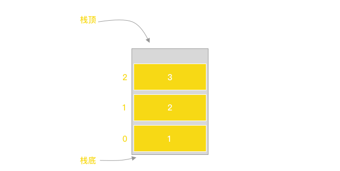
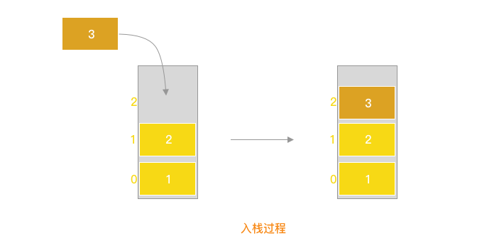
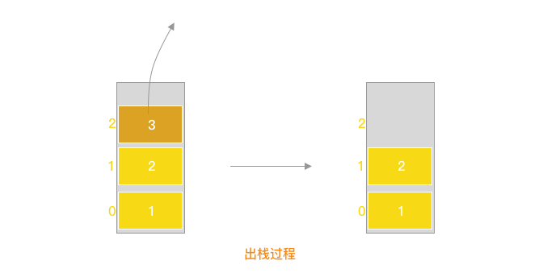

### 3-25 学习数据结构与算法 By JS：栈

#### 1.前言

栈是一种遵循`后进先出`原则的有序集合；添加和删除的元素都在`同一端进出（即栈顶）`，另一端的元素在底部（即栈底），底部元素必须等待顶部元素全部弹出后才能被拿出；

> 后进先出，也可以理解为先进后出，针对栈元素来说，先进去的元素必然最后才会出去，理解这个意思行

举个例子：

我们有一个`空箱子`和一堆`书`，`书的大小`和`空箱子大小`<u>一致</u>；往空箱子内一本一本`放书的过程`就是`入栈的过程`；`拿书的过程`就是`出栈的过程`；也可以参考下下面的三张图片，加深下印象；







#### 2.栈结构的实现
栈结构的模拟，我们可以使用js原生的数组来实现，也可以用js对象来实现，这里将两种方法都实现一下；

##### 2.1 栈结构所拥有的方法

```js
class Stack() {
	// 1.添加元素、入栈
  push(item) {}
  // 2.删除元素、出栈，移除栈顶元素并返回该元素
  pop() {}
  // 3.返回栈顶元素，只读，不修改栈内元素
  peek() {}
  // 4.判断栈是否为空
  isEmpty() {}
  // 5.清空栈
  clear() {}
  // 6.返回栈内元素数量
  size() {}
}
```

##### 2.2 数组模拟栈的实现

使用数组来模拟栈结构有以下优点

- 使用数组`原生方法`操作栈的入栈(`push`)和出栈(`pop`)，当然也可以使用`unshfit`和`shift`,差别只在插入位置在数组尾部与数组头部的差别
- 无需额外维护栈元素的长度，直接使用数组的`length`属性即可；

缺点是

- 数组是连续存储的，栈元素过多，原本的内存空间不够用的情况下，会重新开辟连续的无占用的内存空间重新存放

```js
class Stack {
  constructor() {
    // 初始化栈
    this.items = []
  }
  
  // 添加栈元素
  push(item) {
  	this.items.push(item)
  }
  
  // 出栈
  pop() {
  	return this.items.pop()
  }
  
  // 查看栈顶元素
  peek() {
  	return this.items[this.items.length - 1]
  }
  
  // 判断栈是否为空
  isEmpty() {
  	return this.items.length === 0
  }
  
  // 返回栈内元素数量
  size() {
  	return this.items.length
  }
  
  // 清空栈元素
  clear() {
  	this.items = []
  	// 或者
  	// this.items.length = 0
  }
}
```

因为测试需要，每次观察变动后的内部元素，所以新增一个`toString`方法，方便观察数据的变化
```js
class Stack {
	// ...
	 toString() {
        if (this.isEmpty()) {
            return "no elements"
        }
        let result = []
        for(let i = 0;i < this.items.length;i++) {
            result.push(this.items[i])
        }
        return result.join(',')
    }
}
```

##### 2.3 对象模拟栈的实现

使用对象来模拟栈结构有以下优点

- 存入方便，直接使用`items[key] = value`，存储即可，获取也同样方便直接使用`items[key]`
- 因为是引用对象，存储不像数组那样需要连续的内存空间，高效使用内存中的片段

缺点是

- 需要多一个`length`字段来维护栈的长度的同时也维护对象的`key`值，防止key值`重复`

```js
class Stack {
  constructor() {
    // 初始化栈
    this.items = {}
    // 需要多维护一个栈元素长度
    this.length = 0
  }
  
  // 添加栈元素
  // 添加完后items会变为
  // {
  //		0: 1,
  //		1: 2,
	// }
  push(item) {
  	this.items[this.length++] = item
  }
  
  // 出栈
  pop() {
    if (this.isEmpty()) {
      return undefined
    }
    this.length--
    const item = this.items[this.length]
    delete this.items[this.length]
  	return item
  }
  
  // 查看栈顶元素
  peek() {
    if (this.isEmpty()) {
      return undefined
    }
  	return this.items[this.length - 1]
  }
  
  // 判断栈是否为空
  isEmpty() {
  	return this.length === 0
  }
  
  // 返回栈内元素数量
  size() {
  	return this.length
  }
  
  // 清空栈元素
  clear() {
  	this.items = {}
    this.length = 0
  }
}
```

同样的，新增一个`toString`方法，方便观察数据的变化

```js
class Stack{
	// ...
	toString() {
		if (this.isEmpty()) {
			 return "no elements"
		}
		// 获取对象内的所有value
		const items = Object.values(this.items)
		let result = []
    for(let i = 0;i < items.length;i++) {
    	result.push(items[i])
    }
    return result.join(',')
	}
}
```

##### 2.5 栈的测试
分别对两个`Stack`进行测试，这里因为命名相同，我们挨个来测就好；添加我们的测试用例来看下结果如何

```js
const s = new Stack()
// 新增一些元素
s.push(1)
s.push(2)
s.push(3)
// 打印下栈
console.log('stack elements:', s.toString(), ", size:", s.size())
// 元素出栈
console.log('pop result:', s.pop())
// 打印下栈
console.log('stack elements:', s.toString(), ", size:", s.size())
// 获取栈顶元素
console.log('peek:', s.peek())
// 打印下栈
console.log('stack elements:', s.toString(), ", size:", s.size())
s.push(666)
// 打印下栈
console.log('stack elements:', s.toString(), ", size:", s.size())
// 判断栈是否是空
console.log('isEmpty:', s.isEmpty())
s.clear()
// 打印下栈
console.log('after clear stack elements:', s.toString(), ", size:", s.size())

// 经过测试，我们得到以下内容，符合栈结构的结果
// stack elements: 1,2,3 , size: 3
// pop result: 3
// stack elements: 1,2 , size: 2
// peek: 2
// stack elements: 1,2 , size: 2
// stack elements: 1,2,666 , size: 3
// isEmpty: false
// after clear stack elements: no elements , size: 0
```


#### 3.使用栈来解决的问题

##### 3.1 10进制转2进制方法的实现

示例：

输入：10

输出： 01010

10进制转2进制，我们一般使用10 ➗ 2后取`余数`与`结果`，结果`继续➗2`直到商为0之后`倒序取余数`，即为2进制的结果；具体看下面的例子：

举例10进制9转2进制

- 9 % 2 商为 4 余数为1
- 4 % 2 商为2 余数为0
- 2 % 2 商为1 余数为0 
- 1 % 2 商为0 余数为1
- 0 % 2 商为0 余数为0

结果为01001;

实现下代码逻辑

```js
function decimal2Binary(num) {
  const stack = new Stack()
  let i = 0
 	// 0在这里面起到循环中端，不能使用num >= 0, 0 / 2会始终返回0，进入无限循环
  while(num > 0) {
    const mod = num % 2
    num = Math.floor(num / 2)
    stack.push(mod)
  }
  let binary = ""
  while(!stack.isEmpty()) {
    binary += stack.pop()
  }
  return binary
}
```


##### 3.2 [leetcode第20题：有效的括号](https://leetcode-cn.com/problems/valid-parentheses/)

给定一个只包括 `'('`，`')'`，`'{'`，`'}'`，`'['`，`']'` 的字符串 `s` ，判断字符串是否有效。

有效字符串需满足：

1. 左括号必须用相同类型的右括号闭合。
2. 左括号必须以正确的顺序闭合。

可以试着用栈来解决下这个问题：)
