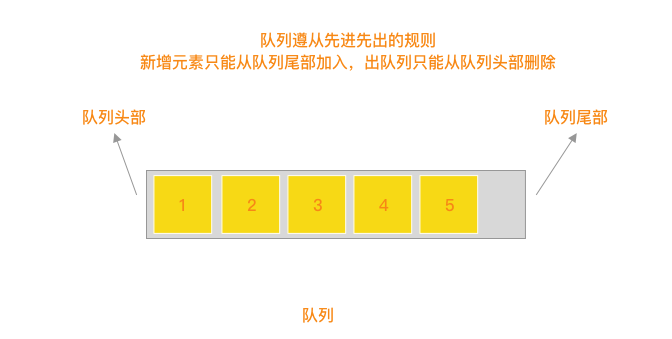
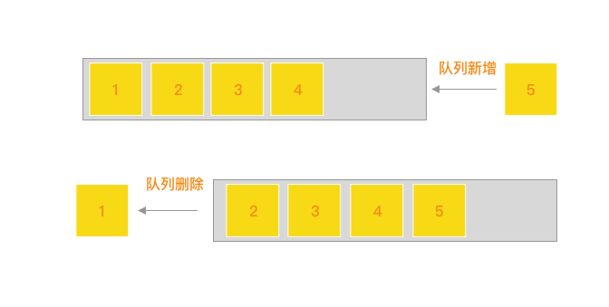

### 4-19 学习数据结构与算法 By JS：队列和双端队列

文章实现思路来源《学习JavaScript数据结构与算法》

#### 1.前言

`队列`是一种遵循`先进先出`原则的有序集合；与`栈`类似，但`添加`是在队列的`尾部`，`删除`是在队列`头部`；

> 举个例子：
> 队列就类似于我们在超市排队付款，必须等待按秩序从头到尾的排队，每次只能等待首位人员买单完成后第二位才能付款，后来的人只能在队伍末位继续排队（插队是无耻的行为），这样的流程就和队列的进出原则一样；我们可以看下面的描述队列的图




#### 2.队列结构的实现

和栈结构的一样，我们同样可以使用js原生的数组来实现，也可以用js对象来实现，这里将两种方法都实现一下；

##### 2.1 队列结构所拥有的方法

```js
class Queue() {
	// 1.添加元素、入栈
  enqueue(item) {}
  // 2.删除元素、出栈，移除栈顶元素并返回该元素
  dequeue() {}
  // 3.返回队列头部元素，只读，不修改栈内元素
  peek() {}
  // 4.判断队列是否为空
  isEmpty() {}
  // 5.清空队列
  clear() {}
  // 6.返回队列内元素数量
  size() {}
}
```

##### 2.2 数组模拟队列的实现

```js
class Queue {
    constructor() {
      this.items = []
    }

    /**
     * 向队列中插入一个或多个值
     * 这里只实现了一个值
     * 多个值可以这样写
     * this.push(...item)
     *  */
    enqueue(item) {
      this.items.push(item)
    }

    /**
     * 出队列并返回出队列的元素
     */
    dequeue() {
      const item = this.items.shift()
      return item
    }

    /**
     * 返回队列的第一个值，不修改队列
     */
    peek() {
      return this.items[0]
    }

    /**
     * 判断队列是否为空
     * @returns
     */
    isEmpty() {
      return this.items.length === 0
    }

    /**
     * 返回队列的长度
     * @returns
     */
    size() {
      return this.items.length
    }

    /**
     * 清空队列
     */
    clear() {
      this.items = []
    }
}

```

因为测试需要，每次观察变动后的内部元素，所以新增一个`toString`方法，方便观察数据的变化

```js
class Queue {
	// ...
	 toString() {
        if (this.isEmpty()) {
            return "no elements"
        }
        let result = []
        for(let i = 0;i < this.items.length;i++) {
            result.push(this.items[i])
        }
        return result.join(',')
    }
}
```

##### 2.3 对象模拟队列的实现

```js
class Queue {
	constructor() {
    // 多维护一个lowestCount 记录第一个值
		this.lowestCount = 0
		this.items = {}
		this.count = 0
	}

	/**
	 * 向队列中插入一个
	 *  */
	enqueue(item) {
		this.items[this.count++] = item
	}

	/**
	 * 出队列并返回出队列的元素
	 */
	dequeue() {
		if (this.isEmpty()) {
			return undefined
		}
		const item = this.items[this.lowestCount]

		delete this.items[this.lowestCount]
    
		this.lowestCount++

		return item
	}

	/**
	 * 返回队列的第一个值，不修改队列
	 */
	peek() {
		return this.items[this.lowestCount]
	}

	/**
	 * 判断队列是否为空
	 * @returns
	 */
	isEmpty() {
		return this.count - this.lowestCount === 0
	}

	/**
	 * 返回队列的长度
	 * @returns
	 */
	size() {
		return this.count - this.lowestCount
	}

	/**
	 * 清空队列
	 */
	clear() {
		this.items = {}
		this.lowestCount = 0
		this.count = 0
	}
}
```

同样的，新增一个`toString`方法，方便观察数据的变化

```js
class Queue{
	// ...
	toString() {
		if (this.isEmpty()) {
			 return "no elements"
		}
		// 获取对象内的所有value
		const items = Object.values(this.items)
		let result = []
    for(let i = 0;i < items.length;i++) {
    	result.push(items[i])
    }
    return result.join(',')
	}
}
```

##### 2.5 队列的测试

分别对两个`Queue`进行测试，这里因为命名相同，我们挨个来测就好；添加我们的测试用例来看下结果如何

```js
const s = new Queue()
// 新增一些元素
s.enqueue(1)
s.enqueue(2)
s.enqueue(3)
// 打印下栈
console.log('queue elements:', s.toString(), ", size:", s.size())
// 元素出栈
console.log('dequeue result:', s.dequeue())
// 打印下栈
console.log('queue elements:', s.toString(), ", size:", s.size())
// 获取栈顶元素
console.log('peek:', s.peek())
// 打印下栈
console.log('queue elements:', s.toString(), ", size:", s.size())
s.enqueue(666)
// 打印下栈
console.log('queue elements:', s.toString(), ", size:", s.size())
// 判断栈是否是空
console.log('isEmpty:', s.isEmpty())
s.clear()
// 打印下栈
console.log('after clear queue elements:', s.toString(), ", size:", s.size())

// 经过测试，我们得到以下内容，符合队列结构的结果
// queue elements: 1,2,3 , size: 3
// dequeue result: 1
// queue elements: 2,3 , size: 2
// peek: 2
// queue elements: 2,3 , size: 2
// queue enqueue 666, elements: 2,3,666 , size: 3
// isEmpty: false
// after clear queue elements: no elements , size: 0
```


#### 3.双端队列

双端队列是其实是集合了栈与队列的两种特性的有序集合，它允许我们同时在队列头部和尾部添加、删除元素

> 还是举个例子：
>
> 还是把双端队列类比我们在超市排队付款排队的队伍；我们在队伍末位排队的同时，也可以离开队伍末位，去临近的队伍去排队；同样，我们在前面付完款后发现找零不对，重新回到队伍头部找收银员理论；

##### 3.1 双端队列结构所拥有的方法

```js
class Deque() {
    /**
     * 在队列的头部新增一个元素
     * @param {*} item
     */
    addFront(item) {}
    /**
     * 在队列尾部新增一个元素
     */
    addBack(item) {}
    /**
     * 移除头部元素
     */
    removeFront() {}
    /**
     * 移除尾部元素
     */
    removeBack() {}
    /**
     * 返回头部元素，不做操作
     */
    peekFront() {}
    /**
     * 返回尾部元素，不做操作
     */
    peekBack() {}
    // 4.判断队列是否为空
    isEmpty() {}
    // 5.清空队列
    clear() {}
    // 6.返回队列内元素数量
    size() {}
    toString()
}
```

##### 3.2 双端队列的实现

数组实现不麻烦，这里只列举下使用对象方式实现的方法

```js
class Deque {
    constructor() {
      this.items = {}
      this.lowestCount = 0
      this.count = 0
    }

    /**
     * 在队列的头部新增一个元素
     * @param {*} item
     */
    addFront(item) {
      if (this.isEmpty()) {
        this.addBack(item)
      } else if (this.lowestCount > 0) {
        this.items[--this.lowestCount] = item
      } else {
        for (let i = this.count; i > 0; i--) {
          this.items[i] = this.items[i - 1]
        }
        this.items[0] = item
        this.lowestCount = 0
        this.count++
      }
    }

    /**
     * 在队列尾部新增一个元素
     */
    addBack(item) {
       this.items[this.count++] = item
    }

    /**
     * 移除头部元素
     */
    removeFront() {
      if (this.isEmpty()) {
        return undefined
      }
      const item = this.items[this.lowestCount]
      delete this.items[this.lowestCount]
      this.lowestCount++
      return item
    }

    /**
     * 移除尾部元素
     */
    removeBack() {
      if (this.isEmpty()) {
        return undefined
      }
      this.count--
      const item = this.items[this.count]
      delete this.items[this.count]
      return item
    }

    /**
     * 返回头部元素，不做操作
     */
    peekFront() {
      if (this.isEmpty()) {
      return undefined
      }
      return this.items[this.lowestCount]
    }

    /**
     * 返回尾部元素，不做操作
     */
    peekBack() {
      if (this.isEmpty()) {
        return undefined
      }
      return this.items[this.count - 1]
    }

    /**
     * 判断队列是否为空
     * @returns
     */
    isEmpty() {
      return this.count - this.lowestCount === 0
    }

    /**
     * 返回队列的长度
     * @returns
     */
    size() {
      return this.count - this.lowestCount
    }

    /**
     * 清空队列
     */
    clear() {
      this.items = {}
      this.lowestCount = 0
      this.count = 0
    }

    toString() {
      if (this.isEmpty()) {
        return "no elements"
      }
      // 获取对象内的所有value
      const items = Object.values(this.items)
      let result = []
      for (let i = 0; i < items.length; i++) {
        result.push(items[i])
      }
      return result.join(",")
    }
}
```

##### 3.3 测试

```js
const s = new Deque()

s.addBack(1)
s.addBack(2)
s.addBack(3)
console.log("deque elements:", s.toString(), ", size:", s.size())
s.addFront(-1)
s.addFront(-2)
s.addFront(-3)
console.log("deque addFront -1,-2,-3:", s.toString(), ", size:", s.size())
console.log("deque removeBack result:", s.removeBack())
console.log("deque removeFront result:", s.removeFront())
console.log("deque elements:", s.toString(), ", size:", s.size())
console.log("peekFront:", s.peekFront())
console.log("peekBack:", s.peekBack())
console.log("deque elements:", s.toString(), ", size:", s.size())
s.addBack(666)
console.log("deque addBack 666, result:", s.toString(), ", size:", s.size())
console.log("isEmpty:", s.isEmpty())
s.clear()
console.log("after clear deque result:", s.toString(), ", size:", s.size())
s.addFront(0)
console.log("deque addFront 0 result:", s.toString(), ", size:", s.size())
s.addBack(1)
console.log("deque addBack 1 result:", s.toString(), ", size:", s.size())

// 得到以下结果
// deque elements: 1,2,3 , size: 3
// deque addFront -1,-2,-3: -3,-2,-1,1,2,3 , size: 6
// deque removeBack result: 3
// deque removeFront result: -3
// deque elements: -2,-1,1,2 , size: 4
// peekFront: -2
// peekBack: 2
// deque elements: -2,-1,1,2 , size: 4
// deque addBack 666, result: -2,-1,1,2,666 , size: 5
// isEmpty: false
// after clear deque result: no elements , size: 0
// deque addFront 0 result: 0 , size: 1
// deque addBack 1 result: 0,1 , size: 2
```


#### 4.循环队列实现击鼓传花游戏

>  击鼓传花游戏解释：在这个游戏中，孩子们围成一个圆圈，把花尽快地传递给旁边的人。某一时刻传花停止，这个时候花在谁手里，谁就退出圆圈、结束游戏。重复这个过程，直到只剩一个孩子（胜者）。

##### 4.1 实现

我们使用队列来实现这个游戏问题

```js
/**
 * @param {string[]} elementsList 
 * @param {number} num 
 * @returns 
 */
function hotPotato(elementsList, num) {
	const queue = new Queue()
	const elimitatedList = []
	// 把所有人员入队
	for (let i = 0; i < elementsList.length; i++) {
		queue.enqueue(elementsList[i])
	}
	// 循环直至只剩一个人
	while (queue.size() > 1) {
		// 循环n次 每次把出队的人员重新假如队尾
    for (let i = 0; i < num; i++) {
			queue.enqueue(queue.dequeue())
		}
    // 循环结束后，尾部人员出队，代表淘汰的人员
		elimitatedList.push(queue.dequeue())
	}

	return {
		elimitated: elimitatedList,
		winner: queue.dequeue()
	}
}
```


#####  4.2测试游戏

```js
const names = ["John", "Jack", "Camila", "Ingrid", "Carl"]
const result = hotPotato(names, 7)
result.elimitated.forEach(name => console.log(`${name}在游戏中被淘汰`))
console.log(`${result.winner}获胜`)

// 输出
// Camila在游戏中被淘汰
// Jack在游戏中被淘汰
// Carl在游戏中被淘汰
// Ingrid在游戏中被淘汰
// John获胜
```


#### 5. 使用双端队列解决回文问题

给定一个`字符串`s，验证它是否是`回文串`，只考虑字母和数字字符，可以`忽略`字母的`大小写`，如果是回文返回true，否则false。

> 回文的定义：指正读和反读都相同的字符序列为“*回文*”，例如：'aaabbbaaa', '12321', 'man na m','a'等

条件：

-  `1 <= s.length <= 2 * 10^5`
- 字符串 `s` 由 ASCII 字符组成


##### 5.1 实现

```js
/**
 * @param {string} s
 * @return {boolean}
 */
 var isPalindrome = function (s) {
    // 去除所有空格
    s = s.toLocaleLowerCase()
    if (s.length <= 1) return true

    const deque = new Deque()
    for (let i = 0; i < s.length; i++) {
          if (/[^A-Za-z0-9]/i.test(s[i])) {
              continue
          }
          deque.addBack(s[i])
    }

   while(deque.size() > 1) {
     if (deque.removeBack() !== deque.removeFront()) {
       return false
     }
   }
   return true
}
```

[原题见leetcode 125.验证回文串](https://leetcode-cn.com/problems/valid-palindrome/)

### 参考资料
[1] 《学习JavaScript数据结构与算法》。