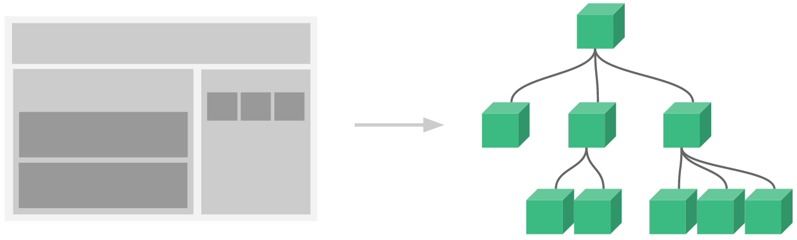

# 前端三贱客

::: tip
写在前面，网页前端发展至今，已经不知度过多少个年头，从最刚开始的`html+css+js`，到现在的三大框架的流行，前端的变化可谓日新月异。
前端主要发展经历了三个阶段。
*第一阶段*，就是我们熟知的`html+css+js`，基本需要手写原生代码；
*第二阶段*，JQuery库的新起，很大程度上解决了兼容问题，能更为方便的操作dom，同时诞生了众多插件，极大的提升了生产力，前端工程师开始逐步走入大家的视野中；
*第三阶段*，前端组件化时代，node的诞生，让这成为可能，三大框架`react+angular+vue`的兴起。
:::

## HTML
> [HTML（超文本标记语言——HyperText Markup Language）是构成 Web 世界的一砖一瓦。它定义了网页内容的含义和结构。](https://developer.mozilla.org/zh-CN/docs/Web/HTML)

> HTML可以展现文本、图片和视频等等。

> HTML 元素通过“标签”（tag）将文本从文档中引出，标签由在“<”和“>”中包裹的元素名组成，HTML 标签里的元素名不区分大小写。也就是说，它们可以用大写，小写或混合形式书写。例如，`<title></title>` 标签可以写成 `<Title></Title>`，`<TITLE></TITLE>` 或以任何其他方式。

简单介绍下html整体的默认展示节点
```html
<!--设置文本类型，将不同浏览器元素的展示方式统一，出现于h5中，html5之前需要定义dtd模式，例如下方-->
<!--<!DOCTYPE HTMLPUBLIC "-//W3C//DTD HTML 4.01//EN" "http://www.w3.org/TR/html4/strict.dtd">-->
<!doctype html>
<!--html节点 lang代表默认语言 开发过程中无需关注-->
<html lang="en">
<head>
<!--meta标签描述性标签-->
<meta charset="UTF-8">
<meta name="viewport" content="width=device-width, user-scalable=no, initial-scale=1.0, maximum-scale=1.0, minimum-scale=1.0">
<meta http-equiv="X-UA-Compatible" content="ie=edge">
<!--设置浏览器当前的title-->
<title>Document</title>
</head>
<body>
    <!--这里是填写元素的地方-->
    <header>头部</header>
    <main>内容</main>
    <footer>尾部</footer>
</body>
</html>
```
html中的元素主要分为三大类，`块级元素、行内块级元素、行内元素`。

 `块级元素`
* 独占一行
* 可以设置其宽度、高度，内外边距
* 宽度默认100%
```html
<!--列举一下块级元素-->
<div></div>
<p></p>
<ul></ul>
<header></header>
<main></main>
<footer></footer>
<aside></aside>
<article></article>
<table></table>
<section></section>
<h1></h1><h2></h2><h3></h3><h4></h4><h5></h5><h6></h6>
```
---
 `行内元素`
* 可以总是和相邻的行内元素在同一行上
* 设置宽高无效，水平方向的padding和margin属性可以设置，但是垂直方向上的无效。
* 宽度默认为内容宽度
* 行内元素只能容纳其他行内元素或者文本
```html
<!--列举一下行内元素-->
<input />
<span></span>
<a></a>
<b></b>
<i></i>
<u></u> 
<!--...-->
```
---
 `行内块级元素`
* 和相邻行内元素在同一行，但是之间会有空白缝隙。
* 宽度默认为内容宽度
* 可以设置其宽度、高度，内外边距
---

所有的html内容，会转化成如下图所示的树形结构。


## CSS
对于css，我们必须了解它的盒子模型, 盒子模型包含以下几个属性：`content`,`padding`,`border`,`margin`

* `margin`：代表盒子的外边距
* `padding`：代表盒子的内边距
* `content`：代表盒子的内容
* `border`：代表盒子的边框

在浏览器里，盒子模型主要分为两种：`标准盒模型`和`IE盒模型`
两种盒子模型的区别主要在`width`的区别


```js
// 标准盒子模型中，盒子的宽度width
const width = content
```


```js
// IE盒子模型中，盒子的宽度width
const width = content + paddingLeft + paddingRight + borderLeft + borderRight 
```

 
## JAVASCRIPT

