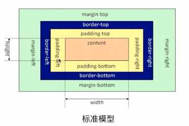
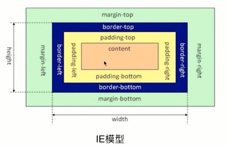

# CSS

 > 层叠样式表 (Cascading Style Sheets，缩写为 CSS），是一种 样式表 语言，用来描述 HTML 或 XML（包括如 SVG、MathML、XHTML 之类的 XML 分支语言）文档的呈现。CSS 描述了在屏幕、纸质、音频等其它媒体上的元素应该如何被渲染的问题。

## 如何建立css
```html
<!doctype html>
<html lang="en">
<head>
<meta charset="UTF-8"><meta name="viewport" content="width=device-width, user-scalable=no, initial-scale=1.0, maximum-scale=1.0, minimum-scale=1.0">
<meta http-equiv="X-UA-Compatible" content="ie=edge">
<title>Document</title>

<!--建立css 方式一-->
<style>
 /*此处填写css*/
 * {
 padding: 0;
 margin: 0;
 }
</style>
<!--建立css 方式二 创建单文件，在当前页面引入-->
<link rel="stylesheet" href="...">


</head>
    <!--建立css 方式三 内联-->
    <div style="padding: 0;margin: 0;"></div>
<body>
  
</body>
</html>
```
## 盒模型
对于css，我们必须了解它的盒子模型, 盒子模型包含以下几个属性：`content`,`padding`,`border`,`margin`

* `margin`：代表盒子的外边距
* `padding`：代表盒子的内边距
* `content`：代表盒子的内容
* `border`：代表盒子的边框

在浏览器里，盒子模型主要分为两种：`标准盒模型`和`IE盒模型`
两种盒子模型的区别主要在`width`的区别


```js
// 标准盒子模型中，盒子的宽度width
const width = content
```


```js
// IE盒子模型中，盒子的宽度width
const width = content + paddingLeft + paddingRight + borderLeft + borderRight 
```

## css语言规则结构


## css选择器
css中选择器种类繁多，比如：
```css
/*通配符选择器*/
* {
 padding: 0;
 margin: 0;
}
/*id选择器*/
#select {
 padding: 0;
 margin: 0;
}
/*类选择器*/
.class-name {
  padding: 0;
  margin: 0;
}
/*标签选择器*/
h1 {
  padding: 0;
  margin: 0;
}
/*属性选择器*/
h1[name] {
  padding: 0;
  margin: 0;
}

/*<h1 name="123"></h1>*/

/*伪类选择器*/
a:focus {
  padding: 0;
  margin: 0;
}
/*伪元素选择器*/
.group::before,
.group::after {
  padding: 0;
  margin: 0;
}

/*...*/

```
 [全部的选择器请点此查看](https://www.w3school.com.cn/cssref/css_selectors.asp)
 
 CSS 选择器有很多，不同的选择器的权重和优先级不一样，对于一个元素，如果存在多个选择器，那么就需要根据权重来计算其优先级。
 
 权重分为四级，分别是：
 
* 代表内联样式，如style="xxx"，权值为 1000；
* 代表 ID 选择器，如#content，权值为 100；
* 代表类、伪类和属性选择器，如.content、:hover、[attribute]，权值为 10；
* 代表元素选择器和伪元素选择器，如div、p，权值为 1。


## float 浮动
float的属性有如下几个：`left`、`right`和`none`

`none`属于默认值，这里不过多关心

float 的元素会脱离文档流

## position定位
position主要用于网页定位

position的值有以下几个：`static`、`relative`、`absolute`和`fixed`;其中static是定位默认值，无需关心；

### relative
relative代表相对定位，它是相对于其自身定位

### absolute
定位设置为absolute，浏览器会递归查找该元素的所有父元素，如果找到一个设置了position:relative/absolute/fixed的元素，就以该元素为基准定位，如果没找到，就以浏览器边界定位。

### fixed
fixed 元素的定位是相对于 window （或者 iframe）边界。


## 弹性盒子
css3中新诞生的一种布局方式，前端布局中最为广泛使用的布局

推荐直接查看阮一峰老师的[博客](http://www.ruanyifeng.com/blog/2015/07/flex-grammar.html?utm_source=tuicool)


## 页面布局


## 变换

## 动画

## 常用到的css属性
``` 
  display: none | block | inline-block | inline | flex
  font-size: 12px
  font-weight: bold
  color: red | rgb | rgba | hls
  background: color | url('...')
  width: 10px
  height: 10px
  margin: 0 0 0 0
  padding: 0 0 0 0
  border: 1px solid #eee
  float: left | right
  visible: hidden
  overflow: hidden
  position: relative | absoulte | fixed
```

